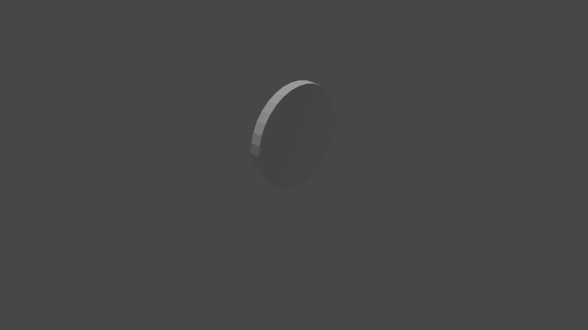

# proyecto-modelado3d-USanz

# Description
This is a model of a robot with 2 axis and two wheels for each one.
Thanks to the [practice 3](https://github.com/clases-julio/p3-pythonscripting-USanz) we have a program that makes the robot wheels and axes for us, and the best part of it is that we can change sizes and colors of the wheels and the axes, and we can even change the distance between those axes, between the wheels, etc.
To see more information about how to change these parameters see the practice 3 [README.md](https://github.com/clases-julio/p3-pythonscripting-USanz#readme) file.

# Preview

Here we have a gif that shows the full progress:

Here is a render of the model progress by dates:

- 3/12/2022

- 3/14/2022

