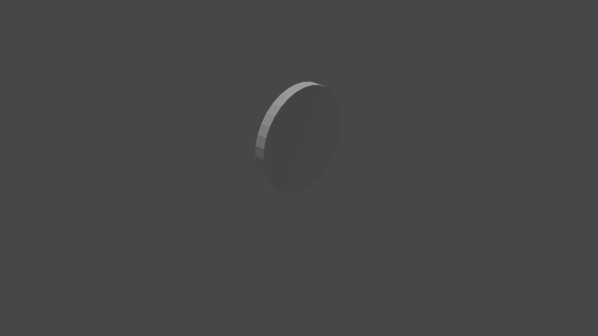
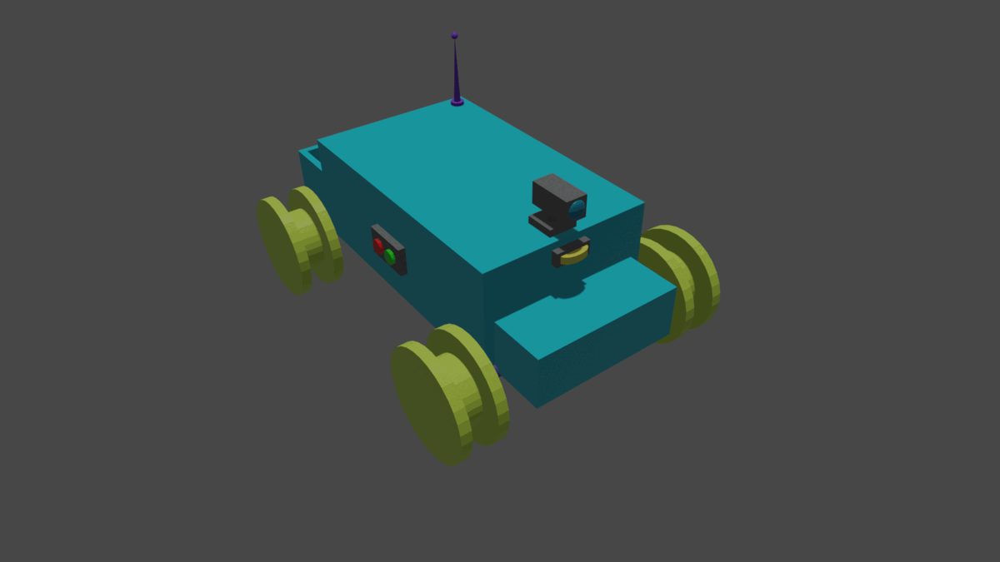
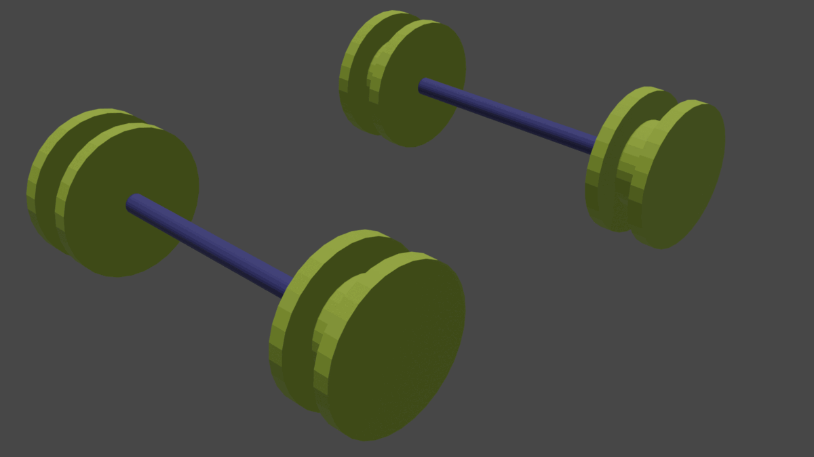
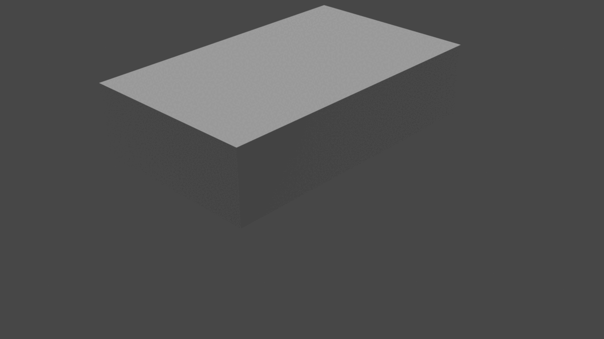
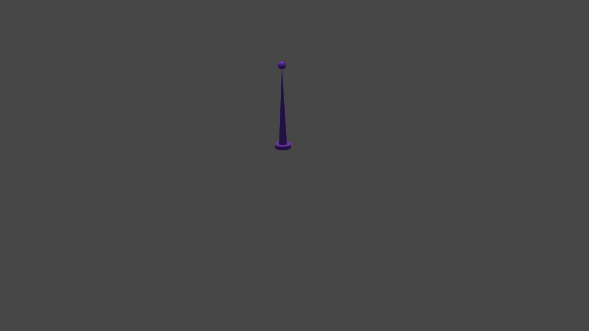

# proyecto-modelado3d-USanz

# Description
This is a model of a robot with 2 axis and two wheels for each one.
Thanks to the [practice 3](https://github.com/clases-julio/p3-pythonscripting-USanz) we have a program that makes the robot wheels and axes for us, and the best part of it is that we can change sizes and colors of the wheels and the axes, and we can even change the distance between those axes, between the wheels, etc.
To see more information about how to change these parameters see the practice 3 [README.md](https://github.com/clases-julio/p3-pythonscripting-USanz#readme) file.

This model was thought for simlator use. It is not physically 3d-printable but it's modeled to be flexible to size changes on the pieces (all measure has a constant asociated to it that may be changed) and the different parts, like the axes with the wheels, are separated from the robot body to be able to spin inside the simulator.

# Preview

Here we have a gif that shows the full progress:

We also have a rotational view of the finished model:

Here is a render of the model progress by dates:

- 3/12/2022

- 3/14/2022

- 3/16/2022

